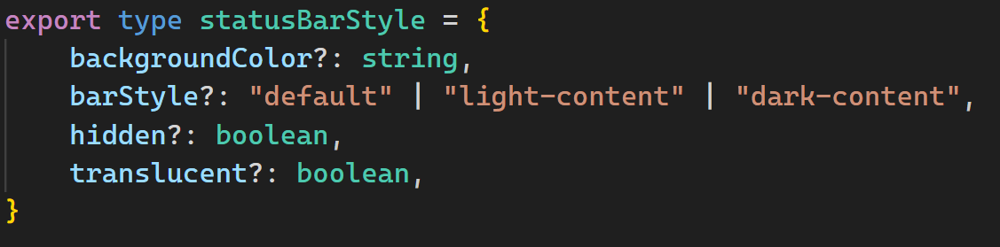

# React Native package that helps you add screen header bars or app bars in your React Native projects.

## Installation

This package requires the default React Native navigation package and (probably) won't work with other packages. React Native Navigation package is necessary because header bar uses the navigation variable from Navigation package to navigate back or if you add headre actions, to navigate to other screens that you specify.

npm install @react-navigation/native
npm install @react-navigation/stack

## Usage

There are various different props that you can pass to header bar to customize it. 

### CustomStyle prop

With this prop you can customize the header bar style. You can change the background color, elevation and height of the header bar. Here is the type:

### Navigation prop

This prop is necessary if navigate back arrow is enabled in header or if you want to travel to other screens with header actions. You need to pass the navigation variable from React Navigation package to this prop. 

### NavigateBack prop

If this prop is set to true, a back arrow will be added to the left side of the header bar. When pressed, it will navigate back to the previous screen.

### Title prop

This prop is used to set the title of the header bar. It will display on the left of the header bar.

### TitleStyle prop

With this prop you can customize the title style. You can change the color, font size and font weight of the title. Here is all available options:

### Actions prop

With this prop you can add actions to the header bar. You can add as many actions as you want (it wont fit on the screen). They will be displayed on the right side of the header bar. The 2 arrows you see in the image below are actions. You can add a callback to execute when they are clicked

### CONCLUSION

I went through all major props that you can pass to the header bar. There are some other props as well that can help you customize your header bar. These include StatusBarStyle and actionStyle. With StatusBarStyle you can change the status bar style. With actionStyle you can change the tint color of the action icons. Here is the type of these props:

### All props

